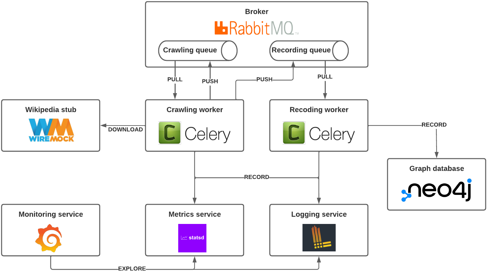
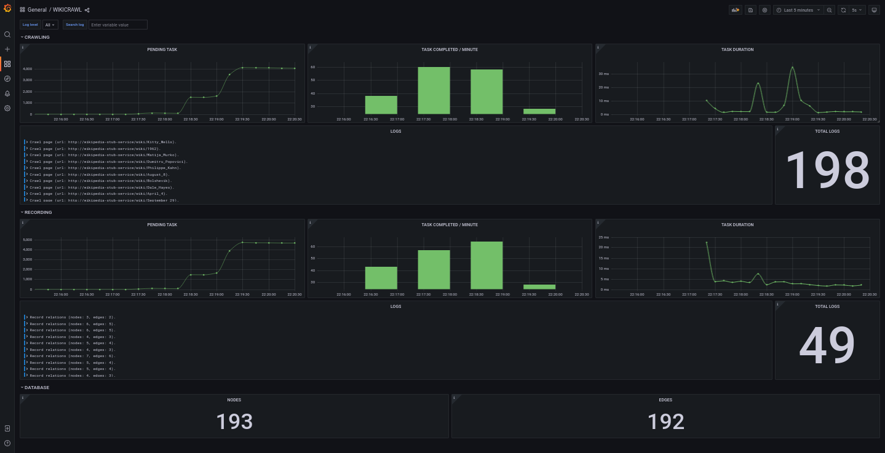
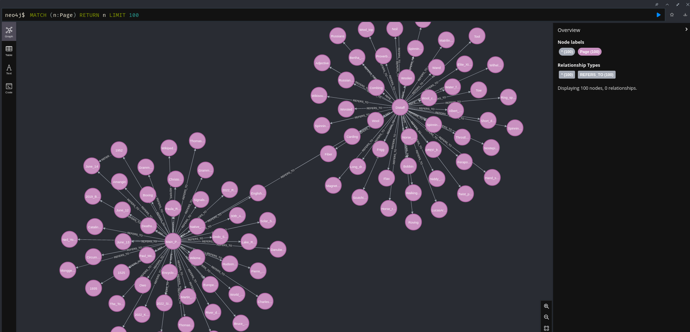

[](https://codecov.io/gh/JulianMaurin/wikicrawl)

# Wikicrawl

Wikicrawl crawls pages from [wikipedia.org](https://wikipedia.org) and records the references between page parsing the `href` from html link tags to a graph database.

The current implementation of the system is based on `docker-compose`.

<picture>
  
</picture>


## Quick start

Requirement : `docker`, `docker-compose`, `make` 

__Nb: Managing docker as a non-root user is required (see: [Docker post-installation steps for Linux](https://docs.docker.com/engine/install/linux-postinstall/)).__

### Run tests

Running `pytest` suite using  `docker-compose`.

```
make build-tests-image
make tests
```

### Generate Wikipedia stub

If you are not familiar with stubbing, take a look at this [page](https://en.wikipedia.org/wiki/Test_stub).

Working with a Wikipedia stub has two benefits. First, it limits the number of requests performed to [wikipedia.org](https://www.wikipedia.org/) to avoid service abuse.
Then it will allow benchmarking of the data collection settings on a size-limited and reproducible dataset.

To do so, a python service running on `docker-compose` will crawl a subset of pages and build the [WireMock](https://wiremock.org/) configuration files into the `.stub` directory generated at the project root directory.

```sh
make generate-stub
```

### Docker-compose instance

To build the the docker images and run the `docker-compose` instance run the command:

```sh
make buildup
``` 

_Running wikicrawl with the default parameters requires generating the Wikipedia stub data using the makefile `generate-stub` target._

Using [lazydocker](https://github.com/jesseduffield/lazydocker) is recommended to monitor the health of the system properly.

Once dockers are up and running you can visit the `[monotiring dashboard](http://localhost:8015/d/lERNI69nk/wikicrawl).

Now create a first crawling task with a random word available in the stub using the command: 

```sh
make crawl-random-stub
``` 

Keep an eye on the `[monotiring dashboard](http://localhost:8015/d/lERNI69nk/wikicrawl) to follow the crawling progressing. 



When the first nodes and edges have been recorded let's visit the database browser to generate a node representation.

Visit `http://localhost:8005/browser/` with your web browser and connect to the default database using the following parameters:
- Connect URL: `neo4://localhost:8006`
- Authentication type: `Username/Password`
- Username: `neo4j`
- Password: `wikicrawl`

Execute the following command on the console present at the top of the browser home page: 

```
MATCH (n:Page) RETURN n LIMIT 100
```


